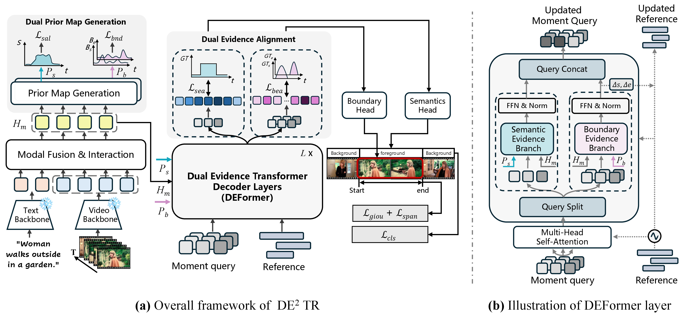

# DE<sup>2</sup>TR: Dual Evidence Detection Transformer for Video Temporal Grounding

[](https://ivanz106.github.io/DE2TR-page/)
[](LICENSE)
[](https://pytorch.org/)

[**Getting Started**](#-getting-started) | [**Training**](#-training) | [**Inference**](#-inference) | [**Model Zoo**](#-model-zoo)

Official implementation of **DE<sup>2</sup>TR**, a DETR-based framework for Video Temporal Grounding (VTG).



## 🚀 Getting Started

**0. Clone this repository.**

```bash
git clone https://github.com/ivanZ106/DE2TR.git
cd DE2TR
```

**1. Install dependencies.**

```bash
pip install -r requirements.txt
```
For anaconda setup, please refer to the official [Moment-DETR](https://github.com/jayleicn/moment_detr).

**2. Prepare datasets.**

Download the QVHighlights features used in [R2-Tuning](https://github.com/yeliudev/R2-Tuning) from [here](https://drive.google.com/drive/folders/1SpM1NG0_WNwrkP5Qdslz7VRhktgF4Rhv?usp=drive_link), which are extracted by CLIP and SlowFast. Unpack them so that the following directories exist relative to the repository root:

```
../features/qvhighlight/
```

Adjust `feat_root` in [de2tr/scripts/train.sh](de2tr/scripts/train.sh) if you keep the features elsewhere. For more information about QVHighlights, please refer to [Moment-DETR](https://github.com/jayleicn/moment_detr).

## 🏃 Training

Each released run corresponds to one command:

```bash
# DE2TR  (results/hl-video_tef-test_data-2026_02_03_22_47_15)
bash de2tr/scripts/train.sh --seed 2018

# DE2TR + BAS  (results/hl-video_tef-test_data-2026_01_29_22_32_50)
bash de2tr/scripts/train.sh --seed 2018 --use_synthetic_data
```

## 🔍 Inference

Download the checkpoint (see `Model Zoo`) and drop it into its run directory under `results/`:

```
results/*/
  opt.json
  best_hl_val_preds_metrics.json
  model_best.ckpt               # <- put the checkpoint here
```

```bash
bash de2tr/scripts/inference.sh results/{run_dir}/model_best.ckpt 'val'
bash de2tr/scripts/inference.sh results/{run_dir}/model_best.ckpt 'test'
```

Replace `{run_dir}` with the path to your saved checkpoint. See [standalone_eval/README.md](standalone_eval/README.md) for the submission details.

## 🏆 Model Zoo

| Run directory | Variant | MR R1@0.5 | MR R1@0.7 | mAP@0.5 | mAP@0.75 | Avg. mAP | Download |
|---|---|---|---|---|---|---|---|
| `hl-video_tef-test_data-2026_02_03_22_47_15` | DE<sup>2</sup>TR | 68.13 | 53.81 | 68.89 | 51.61 | 50.67 | [link](https://drive.google.com/drive/folders/1CXQ0dWoMGAC3v0u-NekrwNfGC4227_La?usp=drive_link) |
| `hl-video_tef-test_data-2026_01_29_22_32_50` | DE<sup>2</sup>TR + BAS | 69.81 | 55.29 | 70.52 | 53.43 | 52.12 | [link](https://drive.google.com/file/d/1vBVlPFKBEArALvVS_E9UiFJEIwwJfFas/view?usp=sharing) |

Validation-split numbers.

## 🙏 Acknowledgements

This codebase is built on [TR-DETR](https://github.com/mingyao1120/TR-DETR), which in
turn derives from [QD-DETR](https://github.com/wjun0830/QD-DETR) and
[Moment-DETR](https://github.com/jayleicn/moment_detr). The QVHighlights annotations
and the evaluation script under `standalone_eval/` come from Moment-DETR. We thank the
authors for making their code and data available.

## 📄 License

MIT. See [LICENSE](LICENSE).

## 📚 BibTeX

If you find the repository or the paper useful, please use the following entry for citation.

```
@inproceedings{zhang2026de2tr,
  title     = {{DE$^2$TR}: Dual Evidence Detection Transformer for Video Temporal Grounding},
  author    = {Zhang, Yifan and Liu, Chengxu and Dun, Yujie and Qian, Xueming},
  booktitle = {European Conference on Computer Vision (ECCV)},
  year      = {2026}
}
```
